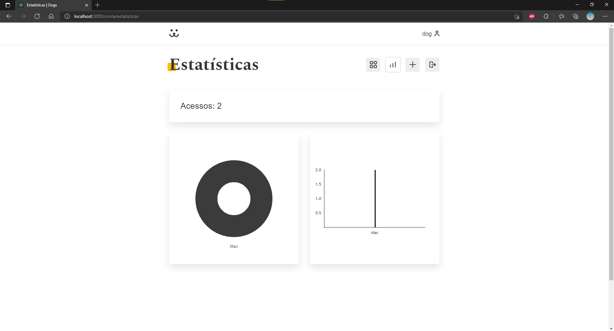

# About This

Final project from React course from Origmid which consists in create a social network for dogs using React.

## Technologies

- [HTML](https://developer.mozilla.org/en-US/docs/Web/html)
- [CSS](https://developer.mozilla.org/en-US/docs/Web/CSS)
- [JavaScript](https://developer.mozilla.org/en-US/docs/Web/javascript)
- [React](https://reactjs.org/)
- [React Router](https://reactrouter.com/)
- [Victory](https://github.com/FormidableLabs/victory)

## Media

